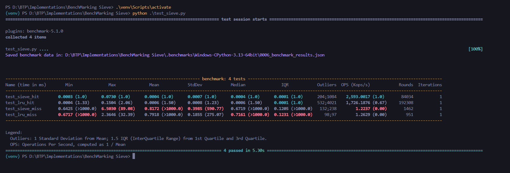

# SIEVE Cache Eviction Algorithm with Benchmarking

## Overview

This implementation introduces the SIEVE cache eviction algorithm alongside a custom implementation of the LRU (Least Recently Used) cache eviction policy. Both caching mechanisms have been benchmarked using Python's `pytest-benchmark` library.

### Key Features of SIEVE
1. **Lazy Promotion:** Items in the cache are not promoted unnecessarily, optimizing performance.
2. **Quick Demotion:** Items can be efficiently evicted when needed.
3. **Thread-Safety:** SIEVE does not require locks for cache hits, unlike LRU, resulting in increased throughput.


### Benchmarking Overview in the Code

1. **Benchmark Scenarios**:
   - **Cache Hit**: Tests how quickly the cache returns a value for a key that is already stored in the cache.
     - Functions:
       - `sieve_cache_test_hit()`
       - `lru_cache_test_hit()`
   - **Cache Miss**: Tests how the cache handles the addition of new values (when a key is not found in the cache).
     - Functions:
       - `sieve_cache_test_miss()`
       - `lru_cache_test_miss()`

2. **Using `benchmark`**:
   - `benchmark` is a fixture provided by `pytest-benchmark`. It runs the specified test function multiple times and measures:
     - Execution time.
     - Statistical metrics like mean, median, and standard deviation of runtimes.
   - The results are saved for analysis using `--benchmark-save=benchmark_results`.

3. **How It Works**:
   - The `benchmark` fixture runs the corresponding test function multiple times under controlled conditions.
   - For example, in `test_sieve_hit`, it repeatedly calls `sieve_cache_test_hit`, which simply retrieves a cached value.
   - Similarly, `test_sieve_miss` tests the behavior when many new values are added to the cache (forcing evictions and insertions).

---

# Benchmark Report

### Summary
This report provides a detailed analysis of the benchmark results for four test cases. The benchmark metrics include **execution time** (minimum, maximum, mean, median), **standard deviation**, **interquartile range (IQR)**, **outliers**, **operations per second (OPS)**, and the **number of rounds and iterations** executed.

---

## Benchmark Results



---

## **Legend**

### **1. Min, Max, and Mean (Time in ms)**
- **Min:** Minimum time taken for a single iteration of the test.
- **Max:** Maximum time taken for a single iteration of the test.
- **Mean:** Average time taken for a single iteration of the test.

### **2. StdDev (Standard Deviation)**
- Shows the variation in execution time for a test. A higher value indicates more inconsistency.

### **3. Median**
- The middle value of all iterations, indicating a typical execution time.

### **4. IQR (Interquartile Range)**
- Measures the range within which the central 50% of the test execution times lie.

### **5. Outliers**
- Counts of test executions that fall outside the normal range. Shown in two formats:
  - Left: Low outliers
  - Right: High outliers

### **6. OPS (Kops/s - Operations Per Second)**
- Indicates the number of operations the test can execute per second. Higher is better.

### **7. Rounds**
- The total number of rounds the test was executed.

### **8. Iterations**
- Number of iterations performed per round. A higher iteration count can give more accurate benchmarking results.

---

## **Key Observations**

1. **Fastest Test:**
   - **`test_sieve_hit`** achieved the highest operations per second (**2,636.7047 Kops/s**) and had the lowest mean execution time (**0.0004 ms**).

2. **Slowest Test:**
   - **`test_lru_miss`** had the lowest operations per second (**1.4103 Kops/s**) and the highest mean execution time (**0.7091 ms**).

3. **Hit vs Miss Performance:**
   - **Hit cases** (both `test_sieve_hit` and `test_lru_hit`) performed significantly faster than **miss cases** (`test_sieve_miss` and `test_lru_miss`), indicating efficient cache hits.

4. **Outlier Variations:**
   - `test_lru_hit` shows a high number of outliers (**2,163 low; 4,928 high**), suggesting variability in runtime performance.
   - Miss cases (`test_sieve_miss` and `test_lru_miss`) also exhibit significant outliers, indicating potential inconsistencies during cache misses.

5. **Standard Deviation:**
   - `test_lru_miss` had the highest standard deviation (**0.1747 ms**), reflecting variability and potential inefficiencies during execution.

---


### Installation
Before running the benchmarks, ensure you have the necessary dependencies installed:

```bash
pip install pytest pytest-benchmark
```

### Command to Run Benchmarks
Run the following command to execute benchmarks and save results:
```bash
pytest test_sieve.py --benchmark-min-rounds=10
```

---
