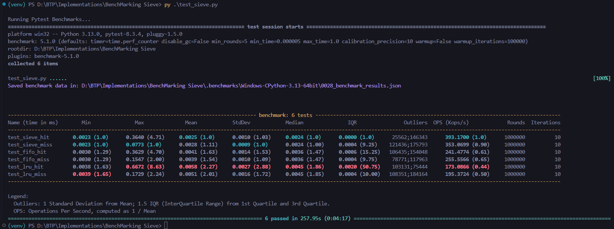
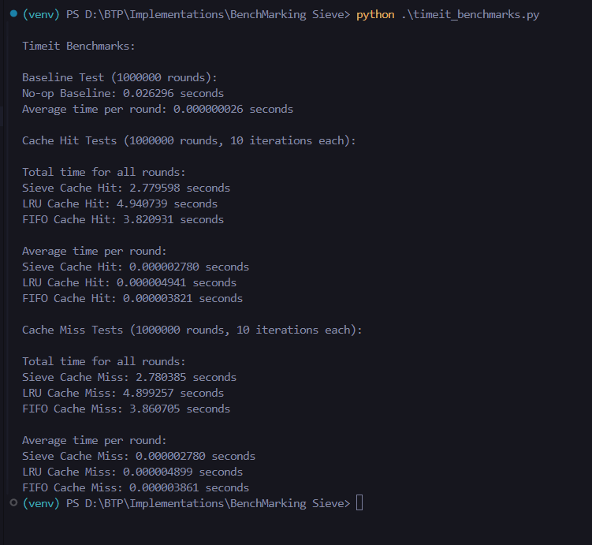
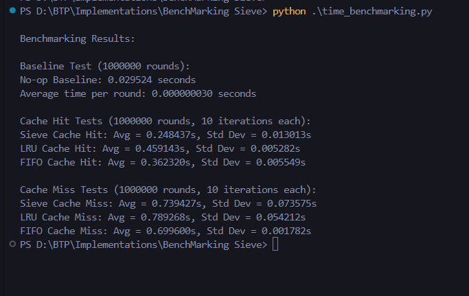
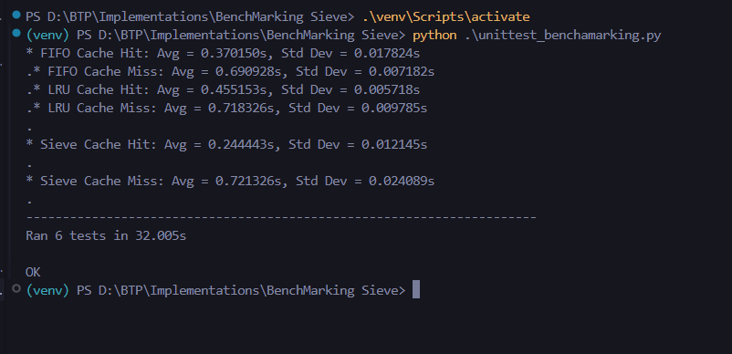

# SIEVE Cache Eviction Algorithm with Benchmarking

## Overview

This implementation introduces the SIEVE cache eviction algorithm alongside a custom implementation of the LRU (Least Recently Used) cache eviction policy. Both caching mechanisms have been benchmarked using Python's `pytest-benchmark` library.

### Key Features of SIEVE
1. **Lazy Promotion:** Items in the cache are not promoted unnecessarily, optimizing performance.
2. **Quick Demotion:** Items can be efficiently evicted when needed.
3. **Thread-Safety:** SIEVE does not require locks for cache hits, unlike LRU, resulting in increased throughput.

# Benchmarking Observations

## **Pytest Benchmark Results**

### Cache Hits:
1. **Sieve Cache Hit**:
   - Min: **0.0023 ms**
   - Max: **0.3640 ms**
   - Mean: **0.0025 ms** (fastest among all hits, with a relative speed of **1.0**).
   - Operations per second (OPS): **393.170 Kops/s**

2. **FIFO Cache Hit**:
   - Min: **0.0030 ms**
   - Max: **0.4003 ms**
   - Mean: **0.0041 ms** (relative speed of **1.63**).
   - OPS: **241.477 Kops/s**

3. **LRU Cache Hit**:
   - Min: **0.0058 ms**
   - Max: **0.6672 ms**
   - Mean: **0.0085 ms** (relative speed of **2.27**, slowest among hits).
   - OPS: **173.0866 Kops/s**

### Cache Misses:
1. **Sieve Cache Miss**:
   - Min: **0.0023 ms**
   - Max: **0.0231 ms**
   - Mean: **0.0023 ms** (relative speed of **1.0**, tied with the fastest miss).
   - OPS: **353.069 Kops/s**

2. **FIFO Cache Miss**:
   - Min: **0.0030 ms**
   - Max: **0.0643 ms**
   - Mean: **0.0041 ms** (relative speed of **1.63**).
   - OPS: **255.556 Kops/s**

3. **LRU Cache Miss**:
   - Min: **0.0039 ms**
   - Max: **0.1729 ms**
   - Mean: **0.0051 ms** (relative speed of **2.01**, slowest among misses).
   - OPS: **195.3724 Kops/s**

### Summary:
- **Sieve Cache** is the fastest for both hits and misses, with the highest OPS.
- **LRU Cache** is the slowest in all cases, with the lowest OPS.

---

## **TimeIt Benchmark Results**

### Baseline:
- **No-op Baseline**:
  - Total Time: **0.026296 seconds**
  - Average Time Per Round: **0.000000026 seconds**

### Cache Hits:
1. **Sieve Cache Hit**:
   - Total Time: **2.779958 seconds**
   - Average Time Per Round: **0.00002780 seconds**

2. **FIFO Cache Hit**:
   - Total Time: **3.820931 seconds**
   - Average Time Per Round: **0.00003821 seconds**

3. **LRU Cache Hit**:
   - Total Time: **4.940739 seconds**
   - Average Time Per Round: **0.00004941 seconds**

### Cache Misses:
1. **Sieve Cache Miss**:
   - Total Time: **2.780835 seconds**
   - Average Time Per Round: **0.00002780 seconds**

2. **FIFO Cache Miss**:
   - Total Time: **3.860705 seconds**
   - Average Time Per Round: **0.00003861 seconds**

3. **LRU Cache Miss**:
   - Total Time: **4.899257 seconds**
   - Average Time Per Round: **0.00004899 seconds**

### Summary:
- **Sieve Cache** consistently performs the best for both hits and misses, with the shortest total and average times.
- **LRU Cache** is the slowest across all categories.

---

## **Time Benchmarking resuklts**

### 1. **Baseline Performance**
   - The baseline no-op function took approximately **0.029524 seconds** for **1,000,000 rounds**, which gives an **average time per round of 0.000000030 seconds**. This serves as a reference for understanding the performance of the caching mechanisms.

### 2. **Cache Hit Performance**
   - **Sieve Cache**: 
     - **Avg Time**: 0.248437 seconds
     - **Std Dev**: 0.013013 seconds
   - **LRU Cache**:
     - **Avg Time**: 0.459143 seconds
     - **Std Dev**: 0.005282 seconds
   - **FIFO Cache**:
     - **Avg Time**: 0.362320 seconds
     - **Std Dev**: 0.005549 seconds
     
   **Insights**: 
   - Sieve cache performs the fastest in cache hit scenarios, outperforming both LRU and FIFO caches.
   - The standard deviation (Std Dev) values suggest the sieve cache is more consistent compared to the LRU and FIFO caches.

### 3. **Cache Miss Performance**
   - **Sieve Cache**: 
     - **Avg Time**: 0.739427 seconds
     - **Std Dev**: 0.073575 seconds
   - **LRU Cache**:
     - **Avg Time**: 0.789268 seconds
     - **Std Dev**: 0.054212 seconds
   - **FIFO Cache**:
     - **Avg Time**: 0.699600 seconds
     - **Std Dev**: 0.001782 seconds
     
   **Insights**:
   - Sieve cache again shows the best performance in terms of speed during cache misses, although the difference with FIFO cache is marginal.
   - FIFO cache is notably more consistent with a much lower standard deviation, suggesting it has a more stable performance in cache miss scenarios.

### 4. **Comparison and Summary**
   - **Cache Hit Scenario**: Sieve cache is the fastest, followed by FIFO and LRU cache.
   - **Cache Miss Scenario**: Sieve cache remains the best, with FIFO cache performing closely and offering more consistent performance.
   - **Consistency**: FIFO cache performs with the least variability (lowest Std Dev) in cache miss scenarios.
   
---

## Unittest Benchmarking Results
### Key Observations from Benchmarking Results

#### **Cache Hit Performance**
- **Sieve Cache Hit:**
  - Average Time: `0.244443s`
  - Standard Deviation: `0.012145s`
  - **Observation**: The Sieve Cache demonstrates the lowest average time for cache hits among all cache types, indicating it is the fastest in handling cache hits.

- **LRU Cache Hit:**
  - Average Time: `0.455153s`
  - Standard Deviation: `0.005718s`
  - **Observation**: The LRU Cache has a noticeably higher average time than the Sieve Cache for cache hits, but the standard deviation is relatively low, suggesting consistent performance.

- **FIFO Cache Hit:**
  - Average Time: `0.370150s`
  - Standard Deviation: `0.017824s`
  - **Observation**: The FIFO Cache falls between the Sieve and LRU Cache in terms of performance. While slightly slower than the Sieve Cache, it performs better than the LRU Cache.

#### **Cache Miss Performance**
- **Sieve Cache Miss:**
  - Average Time: `0.721326s`
  - Standard Deviation: `0.024089s`
  - **Observation**: For cache misses, the Sieve Cache still has the lowest average time, although the difference between the cache types is less pronounced compared to the hit performance.

- **LRU Cache Miss:**
  - Average Time: `0.718326s`
  - Standard Deviation: `0.009785s`
  - **Observation**: The LRU Cache performs similarly to the Sieve Cache in terms of cache miss performance but is slightly slower on average.

- **FIFO Cache Miss:**
  - Average Time: `0.690928s`
  - Standard Deviation: `0.007182s`
  - **Observation**: The FIFO Cache performs the best for cache misses, slightly outperforming the Sieve and LRU Cache.

#### **General Observations**
- **Consistency**: The standard deviation across the tests is fairly low, especially in the FIFO and LRU Cache Hit tests, indicating stable performance across iterations.
- **Cache Miss Comparison**: The performance difference between the three cache types is relatively smaller for cache misses, but FIFO Cache still edges out the other two.
- **Cache Hit Comparison**: The Sieve Cache consistently outperforms the LRU and FIFO caches for cache hits, with a lower average time.

### **Conclusion**
- **Sieve Cache** is the fastest in handling cache hits, but for cache misses, the performance difference between the caches becomes less significant.
- **FIFO Cache** shows a competitive performance, especially for cache misses, and maintains relatively stable results.
- **LRU Cache** is the slowest in both cache hit and miss categories but remains consistent in its performance.

## **Overall Best Cache**
- From both **Pytest** and **TimeIt** results, the **Sieve Cache** is clearly the best performer for hits and misses, showcasing the fastest execution times and highest operations per second.

